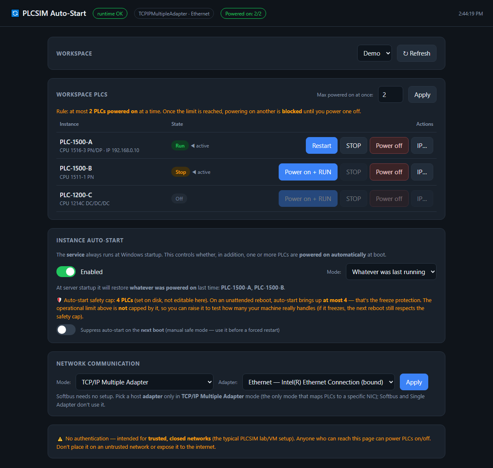

# PLCSIM Auto-Start

**Automatic startup (and remote web control) for Siemens S7-PLCSIM Advanced virtual PLCs.**

PLCSIM Auto-Start is a small always-on web app that **extends** S7-PLCSIM Advanced — it does **not**
replace it. You still create and configure your virtual PLCs in the Siemens PLCSIM Advanced GUI as
usual; PLCSIM Auto-Start reads that workspace and adds what the GUI doesn't give you:

- 🔄 **Automatic startup** — your PLCs come back up on their own after a server reboot, completely
  unattended. This is the headline feature. See
  [enabling auto-start](#enabling-auto-start-capacity-and-the-freeze-loop-risk) for the one capacity
  setting to get right first.
- 🌐 **Remote control from a browser** — power on, RUN, STOP and power off your PLCs from any machine
  on the network. Manage a headless simulation host from your own desktop or another VM, with no
  remote-desktop session needed.
- 💾 **Persistent by default** — every instance is registered against PLCSIM's persistent storage, so a
  PLC's downloaded program survives a restart. Combined with auto-start, a PLC comes back on its own
  after a reboot — nothing to re-open, nothing to re-download from TIA.

> Independent, open-source tool — **not** affiliated with Siemens. It uses the Siemens PLCSIM Advanced
> API, which you install separately under your own Siemens license. The proprietary Siemens DLL is
> **not** included here; the tool locates the one already on your machine.

---

## Other features

Beyond remote control and auto-start:

- **Power-on limit** — cap how many PLCs can be powered on at once (default **1**, adjustable in the UI).
- **Per-PLC IP override**, re-applied on every power-on, so a PLC stays reachable on your subnet.
- **Network mode**: Softbus (zero-config) or TCP/IP mapped to a host adapter.
- **Maintenance mode** — a one-click release of the PLCSIM connection so the official control panel /
  TIA Portal can connect (e.g. to add a new instance) without stopping the service. Powered-on PLCs keep
  running; one click resumes.
- **Installs as a Windows Service** you Start/Stop from `services.msc` / Task Manager. (Because PLCSIM
  needs an interactive session, the service is a launcher that runs the app in the logged-in session;
  `-AsTask` uses a Scheduled Task instead. See [docs/INSTALL.md](docs/INSTALL.md#how-the-service-works-the-session-0-catch).)

---

## Requirements

- **Windows 10 / Windows Server 2016 or newer** (x64).
- **Siemens S7-PLCSIM Advanced** installed (tested with **V20**). Provides the runtime and the API DLL.
- **.NET Framework 4.x** — built into modern Windows; no Visual Studio or .NET SDK required.
- A **logged-in Windows session** — i.e. a user signed in to the desktop, not the hidden SYSTEM
  context. PLCSIM needs this for networking, so the Windows Service runs as a *launcher* that starts the
  app inside the logged-in session. For a server to recover on its own after a reboot, enable auto-logon
  (the installer offers it; see [docs/INSTALL.md](docs/INSTALL.md)).

---

## Quick start (no programming needed)

1. **Download** the project — green **Code** button → **Download ZIP**. You get
   **`PLCSIM-AutoStart-main.zip`** (the prebuilt `PlcsimAutoStart.exe` is inside). Extract it anywhere;
   it produces a `PLCSIM-AutoStart-main` folder.
2. **Double-click `Install.cmd`** and accept the admin prompt (UAC). It sets everything up: detects
   your PLCSIM Advanced install, makes the UI reachable from the LAN (no authentication; it opens the
   firewall for the port), creates `appconfig.txt`, installs an always-on **Windows Service** (Start/Stop
   it from `services.msc` / Task Manager), and offers to enable **auto-logon** for fully unattended boot.
   *(Command-line alternative: run `scripts\install.ps1` from an elevated PowerShell; add `-LocalOnly`
   to bind to localhost.)*
3. Open the UI:
   - on this machine: **http://localhost:8090**
   - from another machine: **http://&lt;this-machine-ip&gt;:8090**

That's it. To remove it later, run `.\scripts\uninstall.ps1` as administrator.

---

## For developers

The prebuilt `PlcsimAutoStart.exe` ships in the repo. Only if you change the backend
(`src\PlcsimAutoStart.cs`) or UI (`wwwroot\index.html`), rebuild with `.\scripts\build.ps1` — no IDE
needed, just the in-box .NET Framework compiler.

---

## Enabling auto-start: capacity and the freeze-loop risk

Auto-start powers your PLCs on at every boot. A virtual S7-PLCSIM PLC uses real CPU and RAM, so one
setting needs to match what the machine can handle.

**The risk.** If auto-start brings up more PLCs than the machine can run at once, the host can slow down
or lock up while they start. Since auto-start runs on every boot, a freeze that forces a restart repeats
on the next boot — a freeze/reboot loop. On an unattended server there is no one there to stop it.

**The cap.** `hard_max_powered_on` (the auto-start cap) is the maximum number of PLCs auto-start will
power on. Set it to the number this machine can run at once; the default is **1**. It applies only to
auto-start — the manual limit `max_powered_on` can be higher for testing and does not change what
happens at the next boot. Both are editable in the UI; raising the cap asks for confirmation.

**The loop-breaker.** If a setup still does not stabilize, a counter is bumped before each auto-start and
cleared only after the service passes repeated `/health` probes (so a soft freeze — processes alive but
the machine unresponsive — does not count as a clean boot). After `boot_fail_limit` non-stabilizing
boots, the service enters **SAFE MODE**: auto-start is skipped, a red banner shows in the UI, and a
*Re-enable* button clears it once you have fixed the load.

Every value is tunable in [docs/CONFIGURATION.md](docs/CONFIGURATION.md).

---

## Documentation

- [docs/INSTALL.md](docs/INSTALL.md) — install, auto-logon, LAN access.
- [docs/CONFIGURATION.md](docs/CONFIGURATION.md) — every `appconfig.txt` key.
- [docs/TROUBLESHOOTING.md](docs/TROUBLESHOOTING.md) — common problems and fixes.

## License

[MIT](LICENSE) © 2026 Marcelo Tapia. Not affiliated with Siemens.
